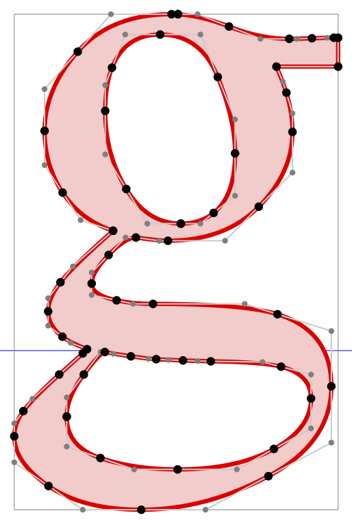

# Inspect glyph geometry

This is a tool for inspecting the outline geometry of glyphs.
It uses [FreeType](https://freetype.org) to read font files and extract glyph data via [FT_Outline_Decompose](http://freetype.org/freetype2/docs/reference/ft2-outline_processing.html#ft_outline_decompose).

The file outline.c contains code that interfaces with FreeType and shields clients from its complexities.

Clients just include outline.h, define outline callbacks, include outline.c, and call a function `outline`:
```
const char *outline(int g, const char *font, int size, void *data)
```
where `g` is the Unicode character id, if positive, or the glyph id in the font, if negative; `font` is a path to a font file; `size` is the scale of the glyph, and `data` is passed on to the outline callbacks. The function returns NULL if there are no errors; otherwise, it returns the name of the FreeType function that failed.

There is a simple client in main.c, which can be used as a template or in a pipe for further processing. To build it, `make test`.

There is a [Lua](https://www.lua.org) client in fd.c, which leaves the processing to a  script.
As a demo, ps.lua outputs PostScript disections of glyphs. See the image below.
This module can also be built as a shared library for Lua named `outline.so` with `make so`.

Before building, set the locations of FreeType headers and library in Makefile. The default there assumes a link to the FreeType source tree.

This code is hereby placed in the public domain and also under the MIT license.


